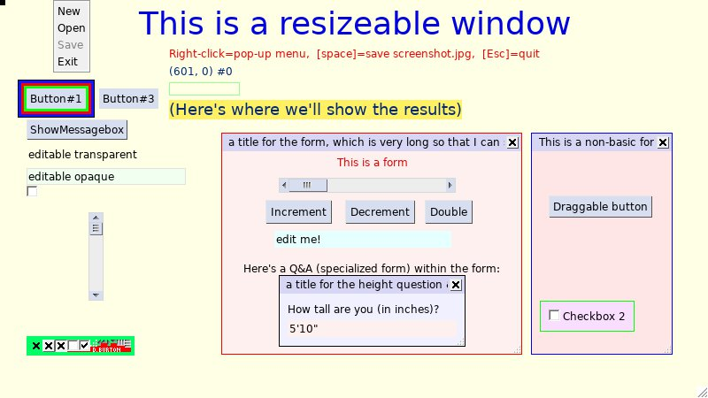

# GUIpygame.py 
A basic sprite-based GUI toolkit for pygame.

(Originally written for pygame 1.9.1 and Python 3.1, and also tested with
Python 2.6, under Windows Vista.  Starting with version 185, I'm using
pygame 1.9.2 and Python 3.2, and also testing with Python 2.7, under
Windows 7.)

This GUI toolkit makes it trivially easy to add basic GUI elements, like
buttons, menus, pop-up messages, etc., to any pygame program.  It does not
require changing the structure of your pygame program or its event loop.
The GUI elements are pygame sprites.

Two main classes are defined: **Widget** and **WidgetGroup**, plus several subclasses
of these two main classes, and a few additional globals.

**Widget** is a subclass of pygame's Sprite class, which adds features to define
GUI element sprites ("widgets" or "widget sprites") for things like labels,
menus, text-edit boxes, and forms.  Unlike plain pygame sprites, widgets can
generate pygame events to report results (such as button clicks) to the
application.

**WidgetGroup** is a subclass of pygame's OrderedUpdates group, specifically for
containing widgets.  A WidgetGroup can contain any number of widgets.

A widget always contains exactly one (possibly empty) WidgetGroup (named
.children), so widgets can be nested arbitrarily deeply within one another,
to create complex compound widgets (forms within forms, etc.).

#### WIDGETEVENT
Global WIDGETEVENT is the pygame event number we'll use for all events
generated by widgets.  It is used both for sending results (clicks,
entered text, etc.) from widgets back to the application, and for
widget-to-widget communications.  It must be one of the pygame user event
numbers.

###class Widget(pygame.sprite.Sprite):
A widget is a sprite that can receive pygame events via its notify() method.

Unlike simpler sprites, some widgets can generate pygame events representing
things like button or menu clicks, entered text, etc.

Also, widgets can contain WidgetGroups of other widgets (as .children).

Like regular pygame sprites, widgets always have widget.rect and
widget.image attributes.  But widgets also have some additional attributes
that regular pygame sprites lack:

        1. widget.Id  is an object (usually a string) to identify the widget,
           so that we can tell them apart.  It is shown by __repr__() to help
           make repr(widget) more meaningful, and when a widget generates
           a pygame event, the source widget's id gets passed along as an
           attribute of the event (so that, for example, the application can
           tell which button got clicked).

        2. widget.children  is a WidgetGroup containing a list of all the child
           widgets contained-in / used-by this widget.  Default is empty.

        3. widget.parent  is this widget's parent/container, if this widget
           is contained-in a parent widget, such as a Form.  Default is None.

        4. widget.relative_rect  is a pygame.Rect, similar to widget.rect.
           For "chid" widgets (widgets contained within another widget),
           widget.relative_rect.topleft is the main/master position, relative
           to the parent widget.  For top-level widgets, widget.relative_rect
           is ignored.

        5. widget.bgcolor  is the color of the opaque background, or None if
           the background is transparent.

        6. widget.use_this_mouse_cursor  is either None or else the desired
           mouse cursor to be shown when the mouse is over this widget.

        7. widget.never_has_focus  is True iff, when the mouse cursor is over
           this widget it means that its parent (or perhaps grandparent) is
           considered to still have the mouse focus.  (Except, however, that a
           child of this widget might have focus.)

        8. widget.draggable  can be set to True if you want the user to be able
           to drag the widget around with the mouse.

        9. widget.resizeable  can be set to True if, when the widget is on a
           WrapperForm, the widget should resize along with the wrapper.  Or
           it can be set to 'byMouse' if the widget can also be resized by
           dragging the borders with the mouse.  (You can also set minimum
           resize width and height as widget.min_width and widget.min_height.)

        10. widget.min_width & widget.min_height  specify the minimum width
           and height, respectively, for a resizeable widget.  (These are
           automatically set to something reasonable.)

        11. widget.hasmousefocus  is used by button and menu widgets, and is
           True when the mouse cursor is over the button.  (Other widgets can
           just leave this set to False.)

A widget's size is widget.rect.size, just like other pygame sprites.
    (The update method copies widget.rect.size to widget.relative_rect.size.)
    However, its position can be determined in either of two ways.

A top-level widget's position is widget.rect.topleft, just like for
    regular pygame sprites.

But if the widget is a child of another widget, it is positioned by setting
    widget.relative\_rect.topleft (with the position relative to the parent
    widget), instead of by setting widget.rect.topleft.  The parent widget's
    update method will calculate each child widget's widget.rect.topleft
    (absolute) position by adding the parent widget's position to the child
    widget's relative position.  Thus, for child widgets, the master/main
    postion is widget.relative\_rect.topleft.

###class WidgetGroup(pygame.sprite.OrderedUpdates):
A WidgetGroup is very similar to a regular OrderedUpdates sprite group,
    but it is intended to contain widgets.  (You can also put non-widget
    sprites in a WidgetGroup, but the get_widget_at() method won't find them.)

Also, WidgetGroup has a notify() method to notify all its widgets of pygame
    events.

###class Image(Widget):
Image is just a widget that displays an image (picture).
    Image objects ignore all pygame events, and don't generate them.

Examples:

	apicture = pygame.image.load('mugshot.png')
    myphoto = Image(apicture, pos=(50,30))
        
    # a picture, with a light green background and border:
    apicture = pygame.image.load(GUIpygame.rel2me('GUIpygame.png'))
    image1 = GUIpygame.Image(apicture, pos=(30,380), bgcolor=(0,255,100), padding=4)

Wnen creating an Image instance, you may specify these optional
    keyword parameters:

        pos  the topleft corner of the sprite

        bgcolor  is the background color; defaults to None, meaning transparent

        width  defaults to None, which means to figure it out from the image

        padding  number of extra pixels of "padding" surrounding the image

Available methods include:

       set_bgcolor((0,0,255))  -- change the background color to deep blue.
           (Same as bgcolor=(0,0,255) parameter.)   For transparent, use None.

       set_width(200)  --  set width to 200 pixels, instead of determining
           it from the image.  (Same as width=200 parameter.)

       set_border(3)  -- add a 3-pixel border around the text, the same color
           as the background.  (Same as padding=3 parameter.)

...plus methods inherited from class Widget:

       collidepoint((70,50))  -- is (70,50) within the image?

       etc.

As with any other sprite, you should send an update() message to your
    Image widget before draw()ing its group to blit the sprites to the screen.

###class Label(Image):
Label is just a widget that displays a text string (label).
    Label objects ignore all pygame events, and don't generate them.

    Example:
        mylabel = Label('Hello, world!', pos=(50,30), color=(255,0,0), font=vera_big)

Wnen creating a Label instance, you may specify these optional
    keyword parameters:

        pos  the topleft corner of the sprite

        color  is the color of the text; defaults to black

        font  defaults to the Vera font, "Vera.ttf", if it is available

        bgcolor  is the background color; defaults to None, meaning transparent
                 (Note: text is always rendered with a transparent background
                 if the sprite also has an image attribute)

        width  defaults to None, which means to figure it out from the text

        padding  number of extra pixels of "padding" needed surrounding the text

        offset_from_left  number of extra pixels to the left of the first character

...plus optional image and pic_pos parameters as for Image widgets,
        (used for labels which also include images)

Available methods include:

       set_text('string-of-text')  -- to change the text string

       set_bgcolor((0,0,255))  -- change the background color to deep blue.
           (Same as bgcolor=(0,0,255) parameter.)   For transparent, use None.

       set_width(200)  --  set width to 200 pixels, instead of determining
           it from the length of the text.  (Same as width=200 parameter.)

       set_border(3)  -- add a 3-pixel border around the text, the same color
           as the background.  (Same as padding=3 parameter.)

...plus methods inherited from class Widget:

       collidepoint((70,50))  -- is (70,50) within the label?

       etc.

As with any other sprite, you should send an update() message to your
    Label widget before draw()ing its group to blit the sprites to the screen.

###class SimpleButton(Label):
A Simple Button is like a Label, except that it has a notify()
    method to notify it of events, and if you click it, it generates a pygame event.

It should have either the text= or image= parameter specified; otherwise,
    you'll get a blank button.

Pass the initializer an event.Id value (Id=), to be used when generating
    events.  If the id is omitted, the button caption (text= parameter) is used.

###class Button(SimpleButton):
A Button is like a SimpleButton, except that it changes the
    mouse cursor over the button.    
    
    Example:
    
    button1 = Button( 'Button#1', pos=(30,100) )
    button1.set_border(4)
    button1.draggable = True

###class SimpleCheckbox(Image):
A SimpleCheckbox is a simple 13x13 pixel check-box, with two possible
    states: unchecked and checked.

Clicking on it reverses its state.

Pass the initializer an event.Id value (Id=), to be used when generating
    events.  If the Id is omitted, then 'checkbox' is used (which, obviously,
    is only adequate if there's only one checkbox in your program).

###class Checkbox(SimpleCheckbox, Label):
A Checkbox is a simple 13x13 pixel check-box, plus optional text
    to label it, with two possible states: unchecked and checked.

It is a hybrid class, using multiple-inheritance to combine the features
    of a SimpleCheckbox and a Label.

Clicking on it reverses its state.

Pass the initializer an event.Id value (Id=), to be used when generating
    events.  If the id is omitted, then 'checkbox' is used (which, obviously,
    is only adequate if there's only one checkbox in your program).

Checkbox also differs from SimpleCheckbox in that Checkbox
    adds code to change the mouse cursor over the widget.
    
Example:    
    
    ckbox2 = GUIpygame.Checkbox(Id='ckbox2', pos=(10,190), checked=False, text='Checkbox 2', bgcolor=(250,222,255), padding=10, boxcolors=(0,255,0))
   

###class Menu(Widget):
A vertical menu widget is a widget which contains a WidgetGroup of
    simplebutton widgets, one for each menu item.    
    
Examples:
     
	# A 9-item menu, the easy way (we'll use this as a right-click pop-up menu)
     menu = Menu.ActionMenu( 'create node|remove node|move node from|move node to|'
                                 +'create arc from|create arc to|edit arc name|'
                                 +'edit FSM name|cancel' )

    tb_menu = GUIpygame.wrap_in_titlebar(menu, 'Pop-up menu', closeable=True, draggable=True, Id='popup_menu')
    
    # A four-item menu, the hard way
    menuitem1 = SimpleButton('New')
    menuitem2 = SimpleButton('Open')
    menuitem3 = SimpleButton('Save')
    menuitem3.set_colors(fg=(128,128,128))  # grey (could indicate "disabled")
    menuitem4 = SimpleButton('Exit')
    a4itemMenu = Menu(Id='a4itemMenu')
    a4itemMenu.add_widgets(menuitem1, menuitem2, menuitem3, menuitem4)
    a4itemMenu.rect.topleft = (60, 0)

####@classmethod ActionMenu(cls, labels, selectors=None, pos=(0,0), Id='aMenu'):
Quick constructor of a Menu instance and its buttons.
        The labels are contained in a string and separated by '|' vertical bars.

A button will be created for each label.

The selectors are a list of event.Id values, one for each button.
        If selectors are omitted, then the labels (strings) will be used.
        
If any label is prefixed with "-" then it will be shown greyed-out.  Although
        the "-" is not shown in the menu, if the selectors are allowed to default to
        be the button labels, then the "-" will be included in the event.Id when such
        a menu item is clicked; when such an event is received, it's a good idea to
        pop-up an explanation of why the menu item is disabled.    

###class TextEditBox(Label):
A TextEditBox is like a Label, except that the label is editable
    from the keyboard.

Pass an event.Id value (Id=) to the initializer, for use when generating
    events.  If id is omitted, 'text' is used.

    maxlen  is maximum number of enterable characters allowed (default 80).

    width  is width of edit box, in pixels.

A pygame event will be generated when the user presses the [Enter] key,
    and the text string that the user entered will be stored in event.text
    (and also retained in the widget's .text attribute).
    
Example:

	# This textbox has an light-green opaque background
    textbox2 = TextEditBox( 'editable opaque', maxlen=30, width=180,
                             pos=(30,190), bgcolor=(240,255,240),
                             Id='textbox2' )   
    textbox2.set_boxcolors((225,225,225))  # give it a light grey border 

###class BasicForm(Widget):
General-purpose container class in which multiple widgets are displayed
    within a widget "form."  To use it, first create the individual widgets,
    then (instead of drawing them directly on the display) you can add them to
    a BasicForm widget, and draw it on the display.

The rect parameter specifies the position and size of the form, as a pygame
    Rect, or a tuple of four values (left,top,width,height), or a tuple of two
    pairs ((left,top),(width,height)).  If you don't specify it when you create
    the form, it defaults to (0,0,0,0) and you can fill it in later.  However,
    note that, as with all widgets, there are 2 different Rect attributes which
    are used.  The size should be the same in both (and widget.rect.size
    contains the master copy).  But there are two positions: for top-level
    widgets, widget.rect.topleft is the position and widget.relative_rect is
    ignored.  But for a child widget (a widget contained in a BasicForm or other
    container widget), widget.relative_rect.topleft is the master position,
    which is the position relative to the parent widget, and widget.rect.topleft
    will be periodically reset to be the sum of the parent widget's position and
    the child widget's relative_rect.topleft.

For a transparent background, you must specify bgcolor=None.  The default
    is a very light blue opaque background.

If you want a box (one-pixel border) drawn around your form, then specify
    the boxcolors parameter, e.g., boxcolors=(0,0,0) for a black border.  The
    default is no box.

BasicForm widgets don't generate any pygame events (though the widgets which
    they contain might do so).  Consequently, use of the Id= parameter to name
    your forms is optional.
    
Example:
    
    # Now we're going to create a form with a red box around it:
    #                               left,top width,height            R   G   B                
    form = GUIpygame.BasicForm( rect=((250,150),(340,230)), bgcolor=(255,240,240),
                                boxcolors=(255,0,0), Id='bigform' )
                                
    # Create 2 widgets to go inside the form.  (Positions are relative to the form.)
    form_l1 = Label('This is a form', pos=(1,5), color=(220,0,0))
    form_l1.relative_rect.centerx = form.rect.width // 2  # center it
    form_b1 = Button('Increment', pos=(50,55), three_D=True)
    form_b1.set_border(6)
    
     form.add_widgets(form_l1, form_b1)

###class InputBox(BasicForm):
Question and Answer -- a class for widgets which contain two other
    widgets: a Label (displaying the question), and a TextEditBox (where the
    answer can be entered).  
    
Example:        
    
    qa = InputBox(question='How tall are you (in inches)?', answer='''5'10"''', Id='textbox_howtall')
    qa.relative_rect.midtop = (form.rect.width//2, 140)
    qa = GUIpygame.wrap_in_titlebar(qa, 'a title for the height question & answer', closeable=True, draggable=True, Id='textbox_howtall')
    qa.resizeable = 'byMouse'
    qa.min_height = 22
    qa.min_width = 16

###class Form(BasicForm):
Like BasicForm, but adds a title bar.  Note that the title bar
    uses the top 21 pixel rows of the form, so don't draw other things there.

The titlebar is the first child of the resulting form, and for convenience
    it is also stored as self.titlebar.  

###class ScrollBar(BasicForm):
A horizontal or vertical scroll bar widget.

If slider_size is None, then the slider button is fixed-size 15x15.
    Otherwise, slider_size should be between 1 and 99, specified as the
    desired percentage of the range of values.

    The .value attribute is the floating-point number that gets changed
    when the scroll bar is adjusted.  Conversely, your program can move the
    scroll bar simply by changing the .value attribute.

    Specify min_val & max_val to set the range of values (default is 0.0-100.0).

    Specify small_inc to indicate how much .value changes when one of the
    little arrows is clicked at the end of the scroll bar.

    Specify large_inc to indicate how much .value changes when the space is
    clicked between the slider and the little arrow.

    The default is a vertical scroll bar; if you want a horizontal scroll bar
    then pass horizontal=True.

    Specify the length of the scroll bar by the size= parameter.

The ScrollBar widget tells the application when the user changes .value,
    by generating a pygame event.

###class DialogBox(Form):
A class for use by the MsgBox function.  Dialog boxes are forms which
    contain a titlebar, a label (for the message to be displayed), and buttons
    (represented by a string containing button lables separated by '|'s).

A dialog box generates events indirectly, because its buttons generate
    events.  The button ids (passed in the generated events) are equal to the
    button labels with a dot and the dialog box id appended.  E.g., a dialogbox
    named Id=useralert with a button labeled 'OK' would generate an event with
    Id="OK.useralert" when the [OK] button is clicked.

####def MsgBox(msg='', title='MsgBox', buttons='OK', Id='MsgBox', width=100,pos=None, draggable=True, bg_repaint=None):
Pop up a modal message box.

    The buttons parameter is a string containing '|' characters to separate the
    button names.  E.g., buttons='Yes|No|Cancel' will result in three buttons.

If pos is unspecified, then the message box will be centered.

The optional bg_repaint function can be used to repaint the background
    when the user drags around the message box, but it isn't necessary,
    because the alternate approach of just saving and restoring the display
    surface seems to work fine.     
    
Example:
    
    result = GUIpygame.MsgBox('Click OK to close this draggable box', 
                             'message box title', 
                             'OK|Close|Cancel', 
                             bg_repaint=draw_everything )                               

----------------( Copyright 2011-2012, by David A. Burton )----------------

This work is "lightly copyrighted" free software.  You may copy it and use
it without restriction.  If you copy it (with or without modification),
your only requirement is that the copies must retain this notice.

Additionally, you may incorporate portions or snippets of this work in
other works, without restriction, regardless of whether those other works
are copyrighted or uncopyrighted, and regardless of how they are licensed.
However, as a courtesy, I ask that you include the following notice in
any works which incorporate substantial portions of this work:

	 By Dave Burton
	 Burton Systems Software
	 http://www.burtonsys.com/email/

--------------------------------------------------------------------------